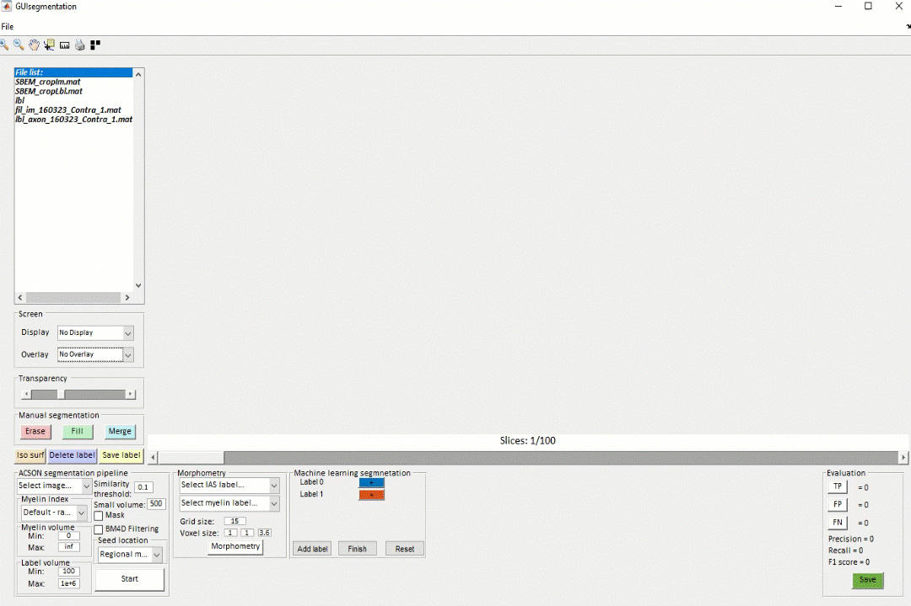

# gACSON

gACSON is a freely available Matlab-based software, developed for visualization, segmentation, assessment, and morphology analysis of myelinated axons in 3D-EM volumes of brain tissue samples.

If you use gACSON in your research, please cite it as

The segmentation algorithm used in gACSON is based on ACSON pipeline described in:

Abdollahzadeh, A., Belevich, I., Jokitalo, E., Tohka, J. & Sierra, A. Automated 3D Axonal Morphometry of WhiteMatter.Sci. Reports9, 6084 (2019).

This software uses several external packages as follows:

- Bio-Formats package: https://www.openmicroscopy.org/bio-formats/downloads/
- Block-matching and 4D filtering (BM4D) algorithm for image denoising: http://www.cs.tut.fi/~foi/GCF-BM3D/
- SLIC supervoxels https://github.com/fk128/SLICSupervoxels
- Accurate fast marching and skeletonization: https://www.mathworks.com/matlabcentral/fileexchange/24531-accurate-fast-marching?s_tid=prof_contriblnk

Please download the Bio-Formats and BM4D packages and place them into the gACSON directory. SLIC supervoxels and Accurate fast marching and skeletonization code is included in gACSON package, but they are distributed under a different open-source licence. Check the licence information in the respective directories.  

This version of the software has been implemented and tested in Matlab R2020b.

